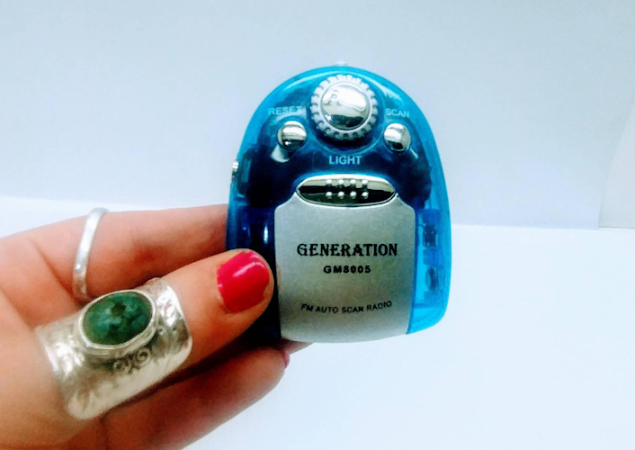
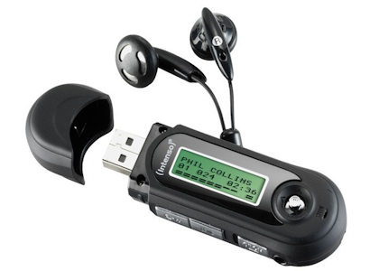
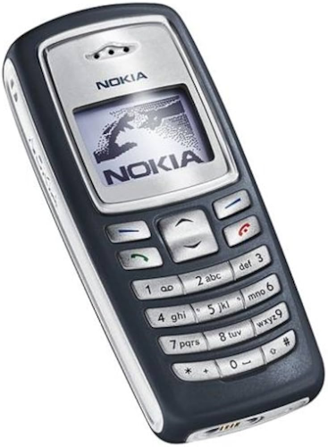
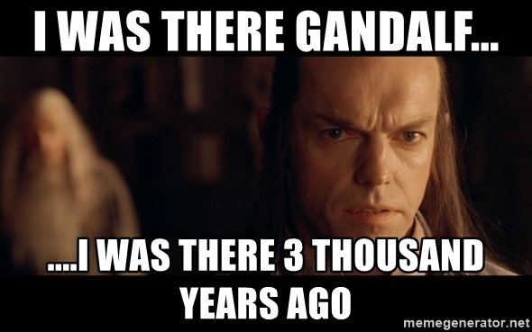

Hello there,

I decided to use this space as a truly personal blog, so that you can get to know me better. Here comes the first post.

I was a very creative and math-genius kind of student. I grew up in a working-class family, so neither of my parents were well-educated. I simply followed what the education system told me to do - do my best in exams, keep my grades high, and don’t question much.

Now, at the age of 34, I’ve finally decided to take all those “find your childhood passion” contents seriously.

I keep asking myself whether I chose the right career path. Because if you don’t know me, I’m not doing great professionally. I started as a firmware developer, then tried to be a consumer electronics entrepreneur, jumped into an edtech startup, did my military service to take a break, and ended up as an embedded systems engineer at a small R&D company of around ten people. I thought I’d stick with that — but then I tried again, co-founding a wellness-device startup. Later I became a father, left my country, and now I’m struggling to work as an engineering consultant — which is tough, because consultancy usually expects sharp specialists, while I’m the complete opposite: a generalist mind.

I keep wondering why I never enjoyed software development. Why can’t I stay interested in code details, yet become a perfectionist about every design detail? That’s when I realized I’m actually more of a designer than an engineer. And that sparked a light from my childhood!

## An Industrial designer at the age of 10

Do you remember those old handheld radios — the ones without a screen, just a few buttons? Something like that:

We weren’t wealthy, so my first teenage music device was one of those radios. And while using it, my passion for consumer electronics started to grow.

I literally remember drawing a better radio in my squared notebook. I liked the original button design, but I spent a lot of my free time trying to come up with something better.

Probably about a year later, I got a pocket MP3 radio. I remember redesigning it in my mind — imagining a bigger display, more user-friendly buttons, or placing the buttons on the sides. I should mention, I was pretty illiterate in those days. I had high scores in school, but only because I did what the system wanted. And the system rarely asked you to actually read books :)
Sidenote: Those USB stick MP3 players were great idea! I never had one of these :(

Then came my first mobile phone — the [Nokia 2100](https://en.wikipedia.org/wiki/Nokia_2100) . I bought it long after most of my friends already had one, but I was still deeply into the mobile phone world.

I was there when they designed the 3210, 3310, 3410, and 3510 — and I was fully aware of every design choice between those models.

Anyway, life changed when I became a high-school teenager. But I still had another passion through all those years.

## Storyteller and funny guy

Between ages 12 and 15, I was kind of the favorite essay writer in my literature class. My teacher always wanted me to read my essays aloud. I kept writing catchy and often funny stories about random topics each week — and somehow kept that going for more than two years.

I also loved writing short stories, though sadly, I can’t find any of them now :(

Despite all that, I didn’t choose to become a writer. When you grow up in a lower-middle-class family in Turkey, and you’re good at school, there’s almost no path other than chasing money. So, I chose money: Electronics Engineering at Istanbul Technical University.

And just like that, all those passions disappeared once I entered university.

I somehow managed to stay a top student until university. Then life hit hard after 18.
I graduated in four years with a decent GPA — 2.81/4.0.

## Real life

After that, I faced real life. I was still trying to find my passion — to change the future, to design something that touches humanity. But apparently, I’ve failed so far. I tried to make an e-book reader case for phones and tablets so people could read comfortably without hurting their eyes. I tried to design a high-tech breath analyzer to help people lose weight. And there were countless other ideas I just never executed.

Even launching this website feels like a success now :)

Designing electronics feels really good, mostly because I’ve developed a new habit: being an enthusiastic learner. I’ve literally relearned electronics engineering from scratch after turning 30. Now I finally feel confident enough to take responsibility — but here comes another hit: I don’t have a strong, proven electronics background on paper. And I’m not living in my home country anymore. That makes things harder — especially when you’re too lazy to learn the local language.

If life gives me a chance, I want to become a product-focused design engineer with a solid electronics background. But we will see. Or just industrial designer with electronics engineering background.

If you read it so far, please give me a favor and say hi from any platform. And give your personal suggestions about my journey.
